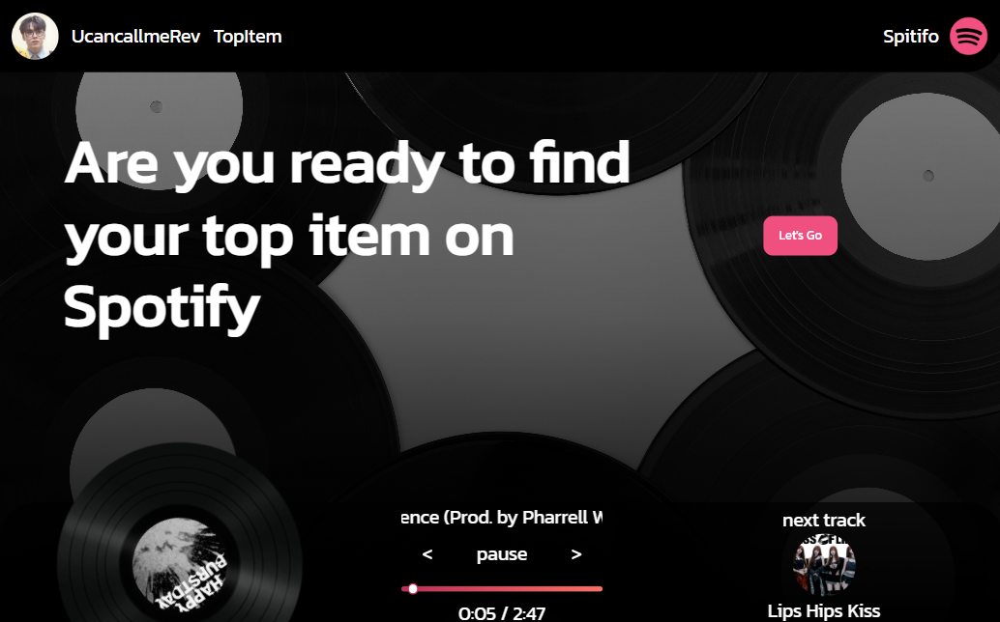
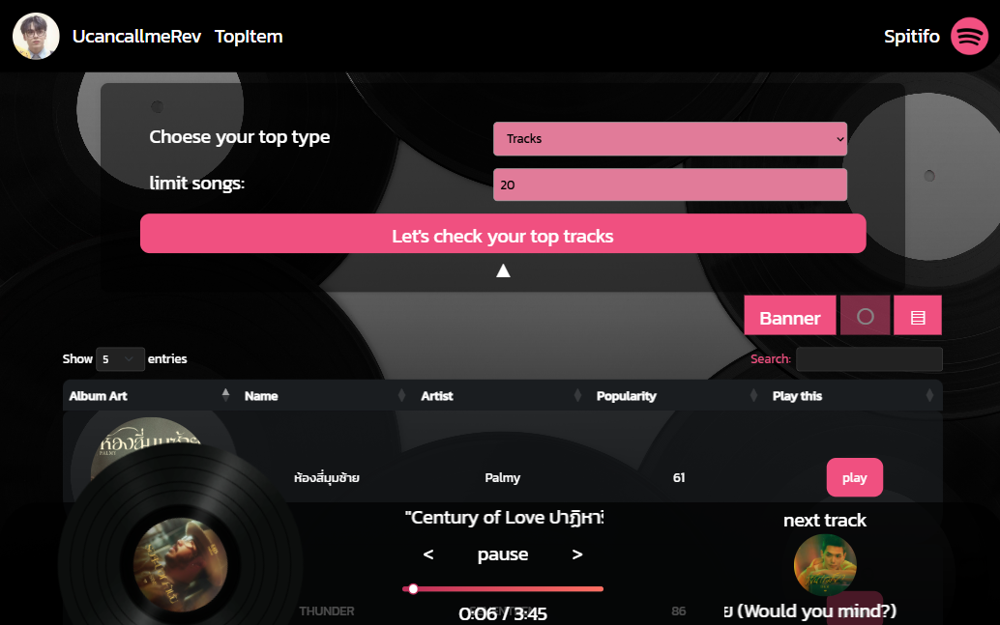

# 🎵 Spitifo

This is a web page that shows your top tracks and artists via Spotify.  

A frontend project for learning **Java**, **Thymeleaf**, and **Bootstrap**.  
Special thanks 🙏 to the [Spotify API](https://developer.spotify.com/) for powering the backend.

---

## 🚀 Wanna try it?

Clone this repository and use your **Spotify Premium** account to set up the project.  
I may deploy it in the future—stay tuned! 🛠️✨

---

## 🖼️ Preview

### 🏠 Home Page  
You can log in and log out with your Spotify account.

---

### 📊 Top Item Page  
This page includes a banner, and you can change the layout when you query your top items.

